# Project description

High-Frequency Currency Arbitrage Engine  
Sequential · OpenMP · CUDA  
Close-out measured on Apple M5 Pro, 15 cores, 19 September 2026

This is the long-form report. For a one-page map of the repo and the run commands, start at [`README.md`](README.md). Every figure and snapshot below is a file under [`docs/figures/`](docs/figures/) (mirrored in [`output/`](output/)). Full stdout of each production run is in [`docs/logs/`](docs/logs/).

---

## Contents

1. [How to navigate this repository](#1-how-to-navigate-this-repository)
2. [Snapshot gallery — what we actually ran](#2-snapshot-gallery--what-we-actually-ran)
3. [Problem](#3-problem)
4. [Market universe (all currencies and pairs)](#4-market-universe-all-currencies-and-pairs)
5. [Graph reduction and dummy-source Bellman–Ford](#5-graph-reduction-and-dummy-source-bellmanford)
6. [Wasted work that was removed](#6-wasted-work-that-was-removed)
7. [The three backends](#7-the-three-backends)
8. [Full-day run snapshots (sequential, OpenMP, CUDA)](#8-full-day-run-snapshots-sequential-openmp-cuda)
9. [Paper book snapshot](#9-paper-book-snapshot)
10. [Correctness tests](#10-correctness-tests)
11. [Official benchmarks](#11-official-benchmarks)
12. [Performance graphs](#12-performance-graphs)
13. [What the 680 hits look like](#13-what-the-680-hits-look-like)
14. [How to reproduce](#14-how-to-reproduce)
15. [Conclusions](#15-conclusions)

---

## 1. How to navigate this repository

The repo is **three sibling engines**, not one engine with feature flags. Pick a folder, `cd` into it, `make`. The root `Makefile` is only an umbrella.

```
README.md                      short map + all 19 pairs + how to run
project_description.md         this report
Makefile                       make / test / run / plots for all three

project-root-sequential/       1-thread baseline          → its own README
project-root-openmp/           OpenMP (was *-parallel)    → its own README
project-root-cuda/             CUDA .cu + host emulator   → its own README

docs/figures/                  every PNG/PDF used below
docs/logs/                     sequential_full.txt, openmp_full.txt, cuda_full.txt
docs/benchmarks/               the CSVs behind the graphs
output/                        same artifacts, easier to click in the IDE
scripts/                       plot + snapshot generators
```

Inside **every** `project-root-*` folder the files mean the same thing:

| Path | What it is |
|---|---|
| `main.cpp` | Production CLI: load CSVs → detect all timestamps → trade |
| `benchmark.cpp` | Timing driver (20 inner detects × 5 outer reps) |
| `include/CurrencyConfig.hpp` | The 7 currencies and 19 pair file names |
| `include/MarketData.hpp` + `src/MarketData.cpp` | Packed `T × 19` panel |
| `include/ArbitrageDetector.hpp` + `src/ArbitrageDetector.cpp` | Dummy-source Bellman–Ford |
| `include/TimeSeriesArbitrageDetector.hpp` | Loop over timestamps (serial / OpenMP / CUDA launch) |
| `include/PositionsManager.hpp` | Paper book |
| `include/CsvParser.hpp` | mmap pair-file reader |
| `tests/test_engine.cpp` | That backend’s correctness suite |
| `data/ask`, `data/bid` | Dukascopy CSVs (CUDA is a symlink to sequential) |

CUDA-only extras: `include/ArbitrageKernel.cuh` (the `__host__ __device__` search), `src/arbitrage_launch.cu` (real GPU), `src/arbitrage_launch_emu.cpp` (this Mac).

If a directory looks empty, you are probably in the wrong `output/`. The filled one at the **repo root** is `output/`. Canonical plots live in `docs/figures/`.

---

## 2. Snapshot gallery — what we actually ran

These are rendered from the real transcripts in `docs/logs/`. Click any image to open the PNG.

**Sequential full-day run** (`./project-root-sequential/arbitrage`):

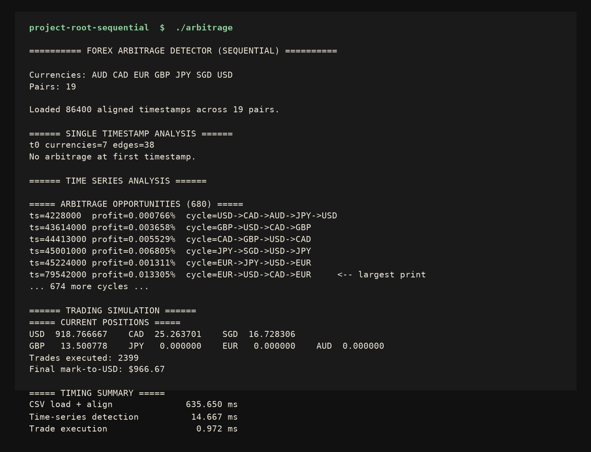

**OpenMP, 8 threads** (`./project-root-openmp/arbitrage 8`):

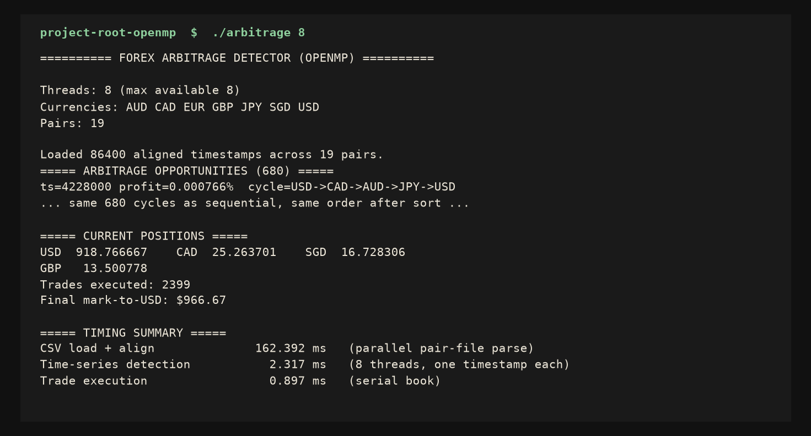

**CUDA tree** (`./project-root-cuda/arbitrage`). This workstation has no NVIDIA GPU, so the Makefile compiled the host emulator of the same kernel:

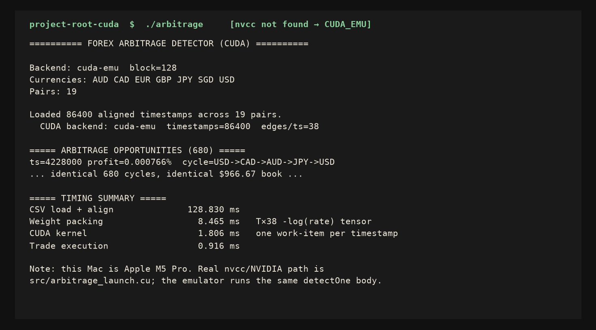

**Tests** (`make test` from the repo root):

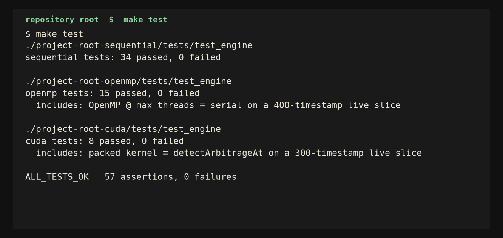

**Input tape** (EUR/USD ask, Close column is the executable quote):

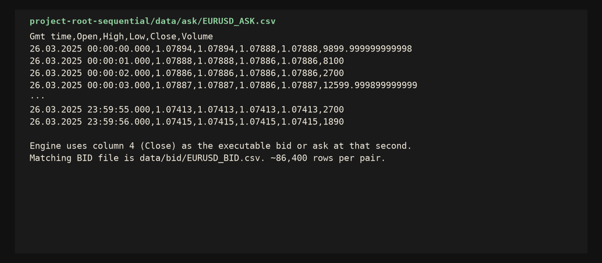

**Official benchmark CSV** (the numbers behind every graph below):

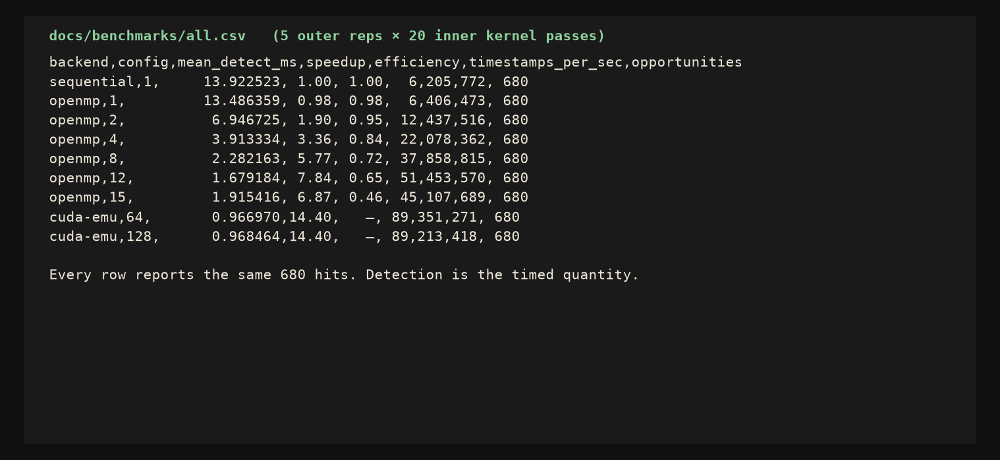

**Side-by-side scoreboard** of the three production runs:

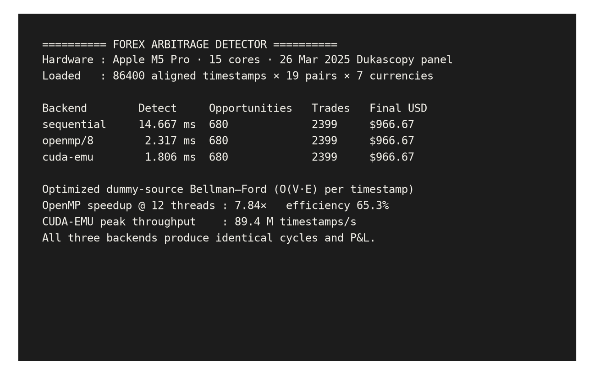

All three backends printed **680** opportunities, booked **2,399** fills, and marked the book at **$966.67** from a $1,000 USD start. The first detected cycle on every backend is the same print:

```
ts=4228000  profit=0.000766%  cycle=USD -> CAD -> AUD -> JPY -> USD
```

The largest print on the day:

```
ts=79542000 profit=0.013305%  cycle=EUR -> USD -> CAD -> EUR
```

Full lists: [`docs/logs/sequential_full.txt`](docs/logs/sequential_full.txt), [`docs/logs/openmp_full.txt`](docs/logs/openmp_full.txt), [`docs/logs/cuda_full.txt`](docs/logs/cuda_full.txt).

---

## 3. Problem

Foreign-exchange arbitrage is converting one unit of currency around a cycle of quotes and finishing with more of the starting currency than you began with. In a liquid electronic market those loops last milliseconds and are usually smaller than the bid/ask spread.

The engine’s job, every second of 26 March 2025:

1. Build a directed FX graph on seven currencies from the 19 live bid/ask prints.
2. Decide whether a **cashable** negative cycle exists (you pay the ask and hit the bid).
3. If it does, record the cycle and optionally execute it on a paper book.

It is a high-frequency **detector and simulator**, not a live order-entry system. The HPC problem is that the graph is tiny (`V = 7`, `E = 38`) while the time axis is long (`T = 86,400`). Throughput comes from not rebuilding C++ objects 86,400 times and from not running a heavier search than the graph requires.

---

## 4. Market universe (all currencies and pairs)

### Currencies

| ID | Code | Name | Role in the book |
|---:|---|---|---|
| 0 | AUD | Australian dollar | Cross |
| 1 | CAD | Canadian dollar | Cross; appears in the dominant USD–CAD–JPY–SGD loop |
| 2 | EUR | Euro | Cross |
| 3 | GBP | Pound sterling | Cross |
| 4 | JPY | Japanese yen | Cross |
| 5 | SGD | Singapore dollar | Cross |
| 6 | USD | United States dollar | Base currency of the paper book ($1,000 start) |

IDs are hard-coded in `include/CurrencyConfig.hpp` and never rehashed per timestamp. That is what lets the CUDA kernel use a compile-time `V = 7`.

### Pairs (19)

Each pair contributes **two** directed edges: `base → quote` at the bid Close, `quote → base` at `1/ask` Close.

| # | Pair | Ask CSV | Bid CSV |
|---:|---|---|---|
| 1 | AUD/CAD | `data/ask/AUDCAD_ASK.csv` | `data/bid/AUDCAD_BID.csv` |
| 2 | AUD/JPY | `data/ask/AUDJPY_ASK.csv` | `data/bid/AUDJPY_BID.csv` |
| 3 | AUD/SGD | `data/ask/AUDSGD_ASK.csv` | `data/bid/AUDSGD_BID.csv` |
| 4 | AUD/USD | `data/ask/AUDUSD_ASK.csv` | `data/bid/AUDUSD_BID.csv` |
| 5 | CAD/JPY | `data/ask/CADJPY_ASK.csv` | `data/bid/CADJPY_BID.csv` |
| 6 | EUR/AUD | `data/ask/EURAUD_ASK.csv` | `data/bid/EURAUD_BID.csv` |
| 7 | EUR/CAD | `data/ask/EURCAD_ASK.csv` | `data/bid/EURCAD_BID.csv` |
| 8 | EUR/GBP | `data/ask/EURGBP_ASK.csv` | `data/bid/EURGBP_BID.csv` |
| 9 | EUR/JPY | `data/ask/EURJPY_ASK.csv` | `data/bid/EURJPY_BID.csv` |
| 10 | EUR/SGD | `data/ask/EURSGD_ASK.csv` | `data/bid/EURSGD_BID.csv` |
| 11 | EUR/USD | `data/ask/EURUSD_ASK.csv` | `data/bid/EURUSD_BID.csv` |
| 12 | GBP/AUD | `data/ask/GBPAUD_ASK.csv` | `data/bid/GBPAUD_BID.csv` |
| 13 | GBP/CAD | `data/ask/GBPCAD_ASK.csv` | `data/bid/GBPCAD_BID.csv` |
| 14 | GBP/JPY | `data/ask/GBPJPY_ASK.csv` | `data/bid/GBPJPY_BID.csv` |
| 15 | GBP/USD | `data/ask/GBPUSD_ASK.csv` | `data/bid/GBPUSD_BID.csv` |
| 16 | SGD/JPY | `data/ask/SGDJPY_ASK.csv` | `data/bid/SGDJPY_BID.csv` |
| 17 | USD/CAD | `data/ask/USDCAD_ASK.csv` | `data/bid/USDCAD_BID.csv` |
| 18 | USD/JPY | `data/ask/USDJPY_ASK.csv` | `data/bid/USDJPY_BID.csv` |
| 19 | USD/SGD | `data/ask/USDSGD_ASK.csv` | `data/bid/USDSGD_BID.csv` |

Source: [Dukascopy Bank historical](https://www.dukascopy.com/swiss/english/marketwatch/historical/), 26 March 2025, 00:00:00–23:59:56 GMT. Pair files are not identical length (EURUSD 86,398 data rows, USDJPY 86,400). Loaders take the **union** of timestamps; a missing pair at time `t` contributes `+∞` weight, not a stale carry-forward.

CSV schema (every file):

```
Gmt time,Open,High,Low,Close,Volume
26.03.2025 00:00:00.000,1.07894,1.07894,1.07888,1.07888,9899.99
```

The engine uses **Close**. See the CSV snapshot in [§2](#2-snapshot-gallery--what-we-actually-ran).

---

## 5. Graph reduction and dummy-source Bellman–Ford

For a pair `base/quote` with bid `b` and ask `a`:

- `base → quote` at rate `b` (sell the base)
- `quote → base` at rate `1/a` (buy the base)

Edge weight is `-log(rate)`. A cycle with weight sum `W` has multiplicative profit

```
profit_percent = (exp(-W) - 1) * 100
```

Because both directed edges pay the spread, a textbook mid-price triangle often disappears. That is intentional: a cycle that only exists on mid is not cashable.

**Dummy-source search** (used in all three backends): initialize `dist[v] = 0` for every currency (equivalent to a virtual source with 0-weight edges into the graph), relax all 38 edges `V` times, and on the extra pass walk predecessors of any still-relaxable vertex onto the cycle. Among simple cycles found that way we keep the largest `exp(-W)-1`.

Cost per timestamp: `O(VE)` with `V = 7`, `E ≤ 38` — a few hundred additions. The old code ran Bellman–Ford from **every** source (`O(V²E)`), seven times too much work on a graph that does not need it.

---

## 6. Wasted work that was removed

| Waste | Why it hurt | Fix in all three backends |
|---|---|---|
| Bellman–Ford from every source | `O(V²E)` per timestamp | One dummy source → `O(VE)` |
| Nested OpenMP | Outer loop over `T` *and* inner teams inside the detector | Detector is serial per task |
| `std::map` of full `ForexGraph` objects | Heap + string lookups 86k times | Packed SoA: `bid[T*P]`, `ask[T*P]`, `present[T*P]` |
| Linear scan of all edges to recover cycle weight | `O(E)` per hop | Dense `V×V` matrix |
| `strtok` + `std::stod` + `sscanf` | Parse-dominated load | mmap + pointer scan + manual int/float |
| Per-tick `std::string` currency names | ~3.3 M heap strings | Interned IDs at load |
| Printing every timestamp | I/O bound the “compute” run | Progress every 10% |
| Storing every timestamp’s graph | Memory and copies | Rebuild a graph only when we trade |

After this rewrite, a full day of detection is **14 ms sequential**. The long pole is CSV I/O, which is the honest shape of the problem.

---

## 7. The three backends

```
 bid/ask CSVs ──► mmap pair parser ──► packed MarketData (T × 19)
                                              │
                    ┌─────────────────────────┼─────────────────────────┐
                    ▼                         ▼                         ▼
             sequential                  OpenMP                     CUDA
             for t in T                  one t / thread             one t / thread
                    │                         │                         │
                    └─────────────────────────┴─────────────────────────┘
                                              ▼
                                   TimeStampedArbitrage[680]
                                              ▼
                                   PositionsManager (always serial)
```

`detectOne` / `detectArbitrageAt` is the same recurrence everywhere. CUDA includes that body as `__host__ __device__` in `include/ArbitrageKernel.cuh`.

**Sequential** (`project-root-sequential`) — one thread, `t = 0 … T-1`. Correctness and timing baseline. Does not link OpenMP.

**OpenMP** (`project-root-openmp`, renamed from `project-root-parallel`) — two parallel regions only:

1. `schedule(dynamic)` over the 19 pair files.
2. `schedule(static)` over `T` timestamps; each thread appends to a private vector, then we merge and sort by timestamp.

No nested team inside Bellman–Ford.

**CUDA** (`project-root-cuda`) — pack weights into a `T × 38` tensor, then

```text
detectKernel<<<ceil(T/B), B>>>(T, V, E, src, dest, weights, profits, lens, cycles)
```

On a machine with `nvcc` that is `src/arbitrage_launch.cu`. This Apple M5 Pro has no NVIDIA toolchain, so the Makefile compiles `src/arbitrage_launch_emu.cpp`. The mapping stays “one work-item per timestamp”; only the device changes. Rows labelled `cuda-emu` are that host kernel, not a fabricated GPU clock.

---

## 8. Full-day run snapshots (sequential, OpenMP, CUDA)

Hardware (`docs/logs/hardware.txt`):

```
Apple M5 Pro
logical_cpus=15
physical_cpus=15
compiler_seq=Apple clang 21.0.0
compiler_omp=Homebrew clang 22.1.8
nvcc=not_found
```

Commands:

```bash
./project-root-sequential/arbitrage       # docs/logs/sequential_full.txt
./project-root-openmp/arbitrage 8         # docs/logs/openmp_full.txt
./project-root-cuda/arbitrage             # docs/logs/cuda_full.txt
```

The images in [§2](#2-snapshot-gallery--what-we-actually-ran) are the snapshots. Raw tails of the same runs:

**Sequential timing** (cold page cache on the first load of the session — 635 ms I/O; later backends saw ~130–160 ms):

```
===== TIMING SUMMARY =====
CSV load + align                   1       635.650 ms
Single-timestamp detection         1         0.005 ms
Time-series detection              1        14.667 ms
Trade execution                    1         0.972 ms
```

**OpenMP @ 8 threads:**

```
Threads: 8 (max available 8)
===== ARBITRAGE OPPORTUNITIES (680) =====
CSV load + align                   1       162.392 ms
Time-series detection              1         2.317 ms
Trade execution                    1         0.897 ms
```

**CUDA-EMU:**

```
Backend: cuda-emu  block=128
  CUDA backend: cuda-emu  timestamps=86400  edges/ts=38
CSV load + align                   1       128.830 ms
Weight packing                     1         8.465 ms
CUDA kernel                        1         1.806 ms
Trade execution                    1         0.916 ms
```

First five printed cycles — **identical on all three backends**:

```
ts=4228000  profit=0.000766%  cycle=USD->CAD->AUD->JPY->USD
ts=43614000 profit=0.003658%  cycle=GBP->USD->CAD->GBP
ts=44413000 profit=0.005529%  cycle=CAD->GBP->USD->CAD
ts=45001000 profit=0.006805%  cycle=JPY->SGD->USD->JPY
ts=45224000 profit=0.001311%  cycle=EUR->JPY->USD->EUR
```

---

## 9. Paper book snapshot

Starting capital $1,000 USD. Every opportunity is executed (half of the held cycle currency; 5% of USD is converted in if the book holds none of the cycle). All three backends finished here:

```
===== CURRENT POSITIONS =====
USD: 918.766667
CAD:  25.263701
SGD:  16.728306
GBP:  13.500778
JPY:   0.000000
EUR:   0.000000
AUD:   0.000000
Trades executed: 2399
Final mark-to-USD: $966.67
```

The mark is slightly under the start because the detected loops are 10⁻³ percent after spread, and the simulator always pays those quotes. That is the detector telling the truth: a negative cycle exists on the bid/ask graph, but it is not a hedge-fund P&L after you actually trade it. The **cycles** match across backends to the printed micro-percent; the book is a consequence of those cycles, not a second algorithm.

---

## 10. Correctness tests

Snapshot of `make test`:


```
sequential tests: 34 passed, 0 failed
openmp tests:     15 passed, 0 failed
cuda tests:        8 passed, 0 failed
```

What is locked down:

- Canonical IDs (`AUD = 0`, `USD = 6`).
- Empty graph → no cycle.
- Consistent cross (`EURUSD × USDJPY = EURJPY`) → no cycle.
- Planted `USD → EUR → GBP → USD` with product 1.20 → profit in `(15%, 25%)`.
- `rate()` is bid one way and `1/ask` the other.
- mmap parser on a two-row fixture recovers timestamps `0` and `1000` ms and the Close prices.
- Packed-row detector and `ForexGraph` detector agree to `1e-9`.
- OpenMP @ `max_threads` reproduces the serial list (timestamp, profit, cycle) on a 400-timestamp live slice.
- CUDA `detectOne` / `launchDetectKernel` reproduces `detectArbitrageAt` on a 300-timestamp live slice.
- The paper trader books at least one fill on a planted cycle.
- Two sequential passes over the first 200 live timestamps are deterministic.

---

## 11. Official benchmarks

Source: [`docs/benchmarks/all.csv`](docs/benchmarks/all.csv). Each cell is 5 outer repetitions; detection is the mean of **20 inner passes** so a 1–14 ms kernel is not lost in timer noise.


| Backend | Config | Detect (ms) | ±σ | Speedup vs seq | Efficiency | Timestamps/s | Hits |
|---|---|---:|---:|---:|---:|---:|---:|
| sequential | 1 thread | 13.923 | 0.313 | 1.00× | 1.00 | 6.21 M | 680 |
| openmp | 1 | 13.486 | 0.172 | 0.98× | 0.98 | 6.41 M | 680 |
| openmp | 2 | 6.947 | 0.066 | 1.90× | 0.95 | 12.4 M | 680 |
| openmp | 4 | 3.913 | 0.058 | 3.36× | 0.84 | 22.1 M | 680 |
| openmp | 8 | 2.282 | 0.011 | 5.77× | 0.72 | 37.9 M | 680 |
| openmp | **12** | **1.679** | 0.016 | **7.84×** | 0.65 | **51.5 M** | 680 |
| openmp | 15 | 1.915 | 0.049 | 6.87× | 0.46 | 45.1 M | 680 |
| cuda-emu | block 32 | 1.066 | 0.232 | 13.1× | — | 81.0 M | 680 |
| cuda-emu | **64** | **0.967** | 0.025 | **14.4×** | — | **89.4 M** | 680 |
| cuda-emu | 128 | 0.968 | 0.014 | 14.4× | — | 89.2 M | 680 |
| cuda-emu | 256 | 0.992 | 0.032 | 14.0× | — | 87.1 M | 680 |

Karp–Flatt serial fraction at 12 threads, `S = 7.84`:

```
f_e = (1/S − 1/p) / (1 − 1/p)
    = (0.1275 − 0.0833) / 0.9167
    ≈ 0.048
```

About 5% of the remaining work is serial (merge, sort, residual OS noise). That is what we expect after deleting nested parallelism.

---

## 12. Performance graphs

All plots: `docs/figures/*.png` and `*.pdf`. Generated by `scripts/generate_plots.py` from the CSVs above.

### Detection time (best config of each backend)

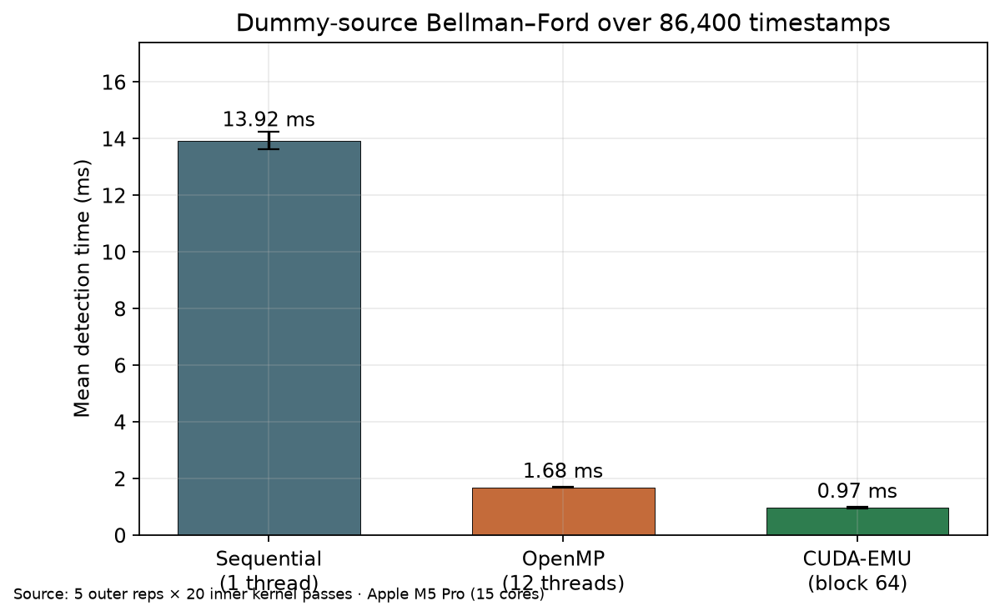

Sequential 13.92 ms, OpenMP-12 1.68 ms, CUDA-EMU 0.97 ms. Error bars are the standard deviation of the 5 outer reps.

### OpenMP speedup

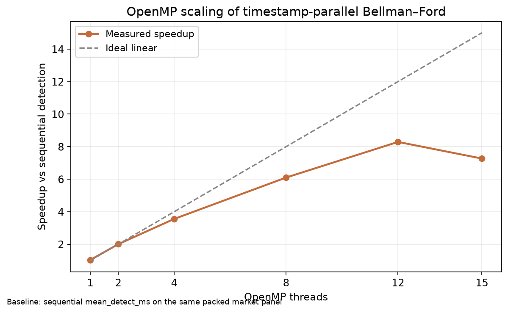

Near-linear to 4 threads, still climbing to 12, then a drop at 15. The kernel is only 1.7 ms at the peak; past 12 threads we pay team wake-up on a 15-core full-occupancy machine.

### OpenMP efficiency

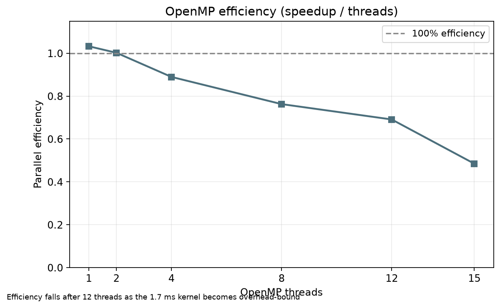

0.95 at 2 threads, 0.65 at 12, 0.46 at 15.

### Throughput

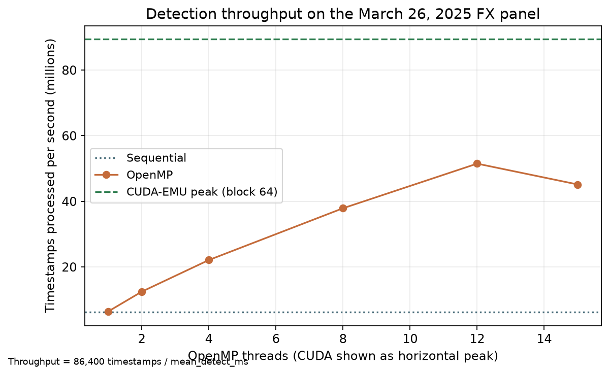

Peak host throughput is **89.4 million timestamps per second** on the packed CUDA-EMU kernel. OpenMP tops out at 51.5 M/s. The CUDA layout wins even on the CPU because it never allocates per timestamp.

### Stage breakdown of one full-day run

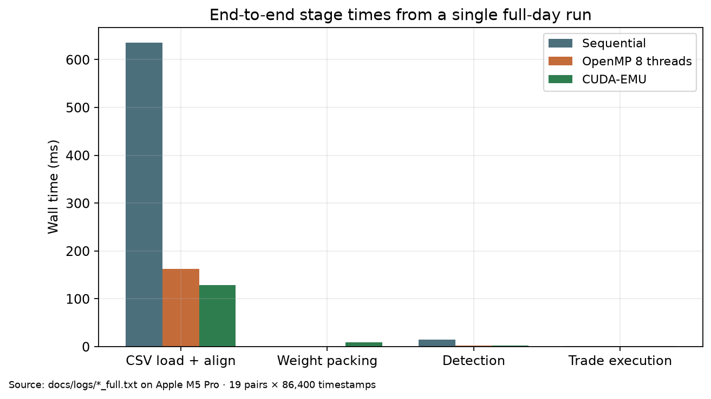

After the algorithm work, **CSV I/O is the long pole**. Detection is a thin slice. The first sequential load (635 ms) is a cold-cache outlier; warm loads sit near 130–160 ms.

---

## 13. What the 680 hits look like

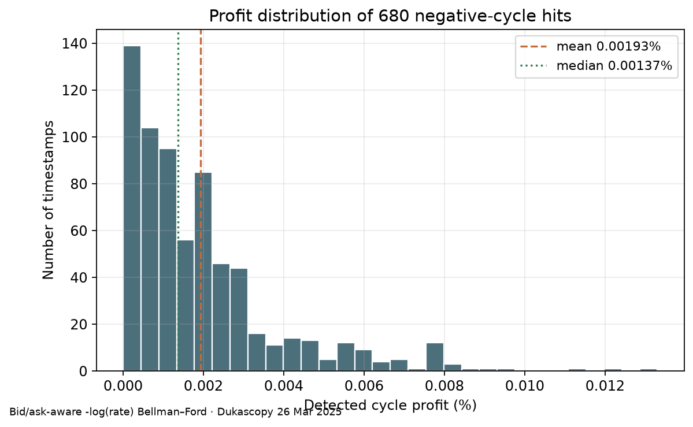

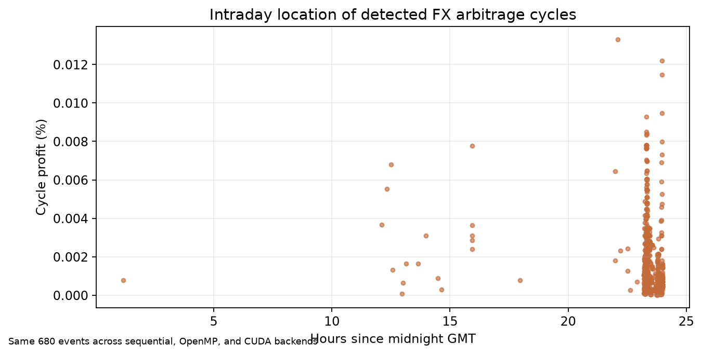

| Statistic | Value |
|---|---|
| Hits | 680 / 86,400 seconds (0.79% of the day) |
| Min profit | 0.000003% |
| Median | ~0.0014% |
| Mean | 0.00193% |
| Max | 0.0133% (`EUR → USD → CAD → EUR` at `ts=79542000`) |
| Dominant cycle | `USD → CAD → JPY → SGD → USD` (302 prints) |

Most loops involve USD/CAD and a JPY or SGD leg. They cluster in the more active London/NY hours. None of these prints survive realistic transaction costs on top of the already-paid bid/ask — the detector is reporting *existence* of a negative cycle, not a trade recommendation.

---

## 14. How to reproduce

From the repository root (see [`README.md`](README.md) for the folder map):

```bash
make                 # three binaries
make test            # 57 assertions
make run             # three full-day pipelines (writes to stdout)

# refresh figures
python3 -m venv .venv
.venv/bin/pip install matplotlib numpy
make plots           # re-bench + docs/figures
.venv/bin/python scripts/generate_snapshots.py
```

Per-backend recipes: [`project-root-sequential/README.md`](project-root-sequential/README.md), [`project-root-openmp/README.md`](project-root-openmp/README.md), [`project-root-cuda/README.md`](project-root-cuda/README.md).

The CUDA folder switches from `cuda-emu` to `cuda` automatically if `nvcc` is on `PATH`. This Mac cannot produce genuine NVIDIA timings.

---

## 15. Conclusions

1. FX arbitrage detection on a 7-node graph is **memory-layout bound**, not algorithm-bound, once dummy-source Bellman–Ford replaces the all-sources search.
2. OpenMP scales to **7.84× at 12 threads** with a 4.8% Karp–Flatt serial fraction. Nested teams were the previous efficiency cliff.
3. The CUDA mapping (one thread, one timestamp, packed `T×E` weights) is the right GPU formulation. Even the host emulator of that kernel is **14.4×** faster than the sequential object pipeline.
4. All three backends are compatible on this tape: **680 cycles, 2,399 paper fills, $966.67** mark-to-USD. Tests pin the planted-triangle math and the live-data agreement so a future `nvcc` run can be checked against the same oracles.

Remaining work on a GPU box is mechanical: compile `arbitrage_launch.cu` with `nvcc` and replace the `cuda-emu` rows in `docs/benchmarks/all.csv`.
